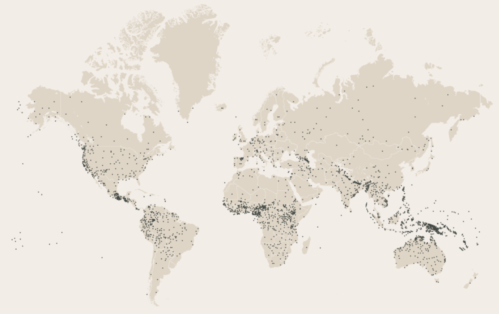

<style>
  h2 {
    font-size: 28px;
    margin: 0px 0px 0px 0px; 
    padding: 0px 0px 0px 0px;
  }
  slides > slide > hgroup + article {
    margin-top: 4px;
  }
</style>


```{r setup, include=FALSE}
knitr::opts_chunk$set(echo = FALSE, fig.width = 6, fig.height = 3, out.width = '100%')

library(owidR)
library(ggplot2)
library(dplyr)

theme_set(theme_owid(import_fonts = FALSE) + theme(axis.title = element_blank()))

```

## What are the four variables in this plot? (x-axis, y-axis, colour, size)
\ 
```{r gapminder, cache=TRUE}
## source: owid

life_exp_gdp <- owid("life-expectancy-vs-gdp-per-capita", rename = c("population", "continent", "life_exp", "gdp")) |>
  na.omit()

life_exp_gdp |>
  ggplot(aes(gdp, life_exp, size = population, colour = continent, label = entity)) +
  geom_point(show.legend = FALSE, shape = 1, stroke = 0.8) +
  scale_x_log10(labels = scales::label_dollar()) +
  ggsci::scale_colour_lancet() +
  scale_size_area(max_size = 20)
```

## What does this chart depict? Who was the creator?
\ 
{height=380pt}

## What does this chart depict? Who was the creator?
\ 
{height=450pt}

## What does this map show?
\ 
{height=440pt}

## What is the x-axis?
```{r royal_families}
## Royal instagram followers | source:https://www-statista-com.libproxy.ucl.ac.uk/study/25128/the-british-royal-family-uk-statista-dossier/
royal_followers <- tibble(family = c("The Royal Family (United Kingdom)",
                                         "Koninklijk Huis (the Netherlands)",
                                         "Kungahuset (Sweden)",
                                         "Det Norske Kongehuset (Norway)",
                                         "Belgian Royal Palace (Belgium)"),
                              followers = c(8700000,
                                            746000,
                                            482000,
                                            215000,
                                            80900))

royal_followers |>
  ggplot(aes(followers, forcats::fct_reorder(family, followers))) +
  geom_col(fill = "#631879") +
  scale_x_continuous(labels = scales::label_comma())
```

## Which is the correct chart?
Aerobic guidelines: At least 150 minutes moderately intensive activity or 75 minutes vigorous activity per week or an equivalent combination of these

```{r true-activity}
## Physical activity: https://www-statista-com.libproxy.ucl.ac.uk/statistics/326672/physical-activity-levels-by-gender-in-england/
# create four graphs: which one is correct
# aerobic guidelines: At least 150 minutes moderately intensive activity (MPA) or 75 minutes vigorous activity (VPA) per week (pw) or an equivalent combination of these
activity_levels <- factor(c("Meets aerobic\nguidelines", "Some\nactivity", "Low\nactivity", "Inactive"),
                          levels = c("Meets aerobic\nguidelines", "Some\nactivity", "Low\nactivity", "Inactive"))

plot_activity <- function(x) {
  x |> 
    ggplot(aes(level, pct)) +
    geom_col(fill = "#00468B") +
    scale_y_continuous(labels = scales::label_percent(), limits = c(0, 0.7)) +
    theme(axis.text.x = element_text(size = 7), axis.text.y = element_text(size = 8),
          plot.title = element_text(size = 8, face = "bold"))
}

plot1 <- tibble(level = activity_levels, pct = c(0.23, 0.3, 0.04, 0.43)) |>
  plot_activity() +
  labs(title = "A")

#actual
plot2 <- tibble(level = activity_levels, pct = c(0.62, 0.11, 0.04, 0.23)) |>
  plot_activity() +
  labs(title = "B")

plot3 <- tibble(level = activity_levels, pct = c(0.05, 0.3, 0.5, 0.15)) |>
  plot_activity() +
  labs(title = "C")

plot4 <- tibble(level = activity_levels, pct = c(0.21, 0.6, 0.13, 0.06)) |>
  plot_activity() +
  labs(title = "D")

cowplot::plot_grid(plotlist = list(plot1, plot2, plot3, plot4))
```

## What is the x-axis?
```{r charities}
# Source https://register-of-charities.charitycommission.gov.uk/sector-data/top-10-charities
charities <- stringr::str_to_title(c("PARKRUN GLOBAL LIMITED",
                                     "KEEP BRITAIN TIDY",
                                     "THE SCOUT ASSOCIATION",
                                     "THE GUIDE ASSOCIATION SOUTH-WEST ENGLAND",
                                     "NEIGHBOURHOOD WATCH NETWORK",
                                     "THE GUIDE ASSOCIATION",
                                     "EDUCATION & EMPLOYERS TASKFORCE",
                                     "THE CHURCH OF JESUS CHRIST OF LATTER-DAY SAINTS",
                                     "THE ROYAL BRITISH LEGION",
                                     "THE NATIONAL TRUST"))


tibble(charity = charities, volunteers = c(279710, 196260, 141659, 100000, 100000, 80000, 63608, 61000, 55000, 50000)) |>
  ggplot(aes(volunteers, forcats::fct_reorder(charity, volunteers))) +
  geom_col(fill = "#008280") +
  scale_x_continuous(labels = scales::label_comma(), limits = c(0, 300000)) +
  theme(axis.text = element_text(size = 8))
```


